```{r setup_01, include = FALSE}
source("_setup.R")
# knitr::clean_cache(TRUE)
htmltools::tagList(
  xaringanExtra::use_clipboard(
    button_text = "<i class=\"fa fa-clipboard\"></i>",
    success_text = "<i class=\"fa fa-check\" style=\"color: #37abc8\"></i>",
  ),
  rmarkdown::html_dependency_font_awesome()
)
xaringanExtra::use_scribble()
```


class: inverse, center, middle

# Version Control System


## `r gt()` is a fully distributed version control system

---
# Version Control Systems (VCS)


.center[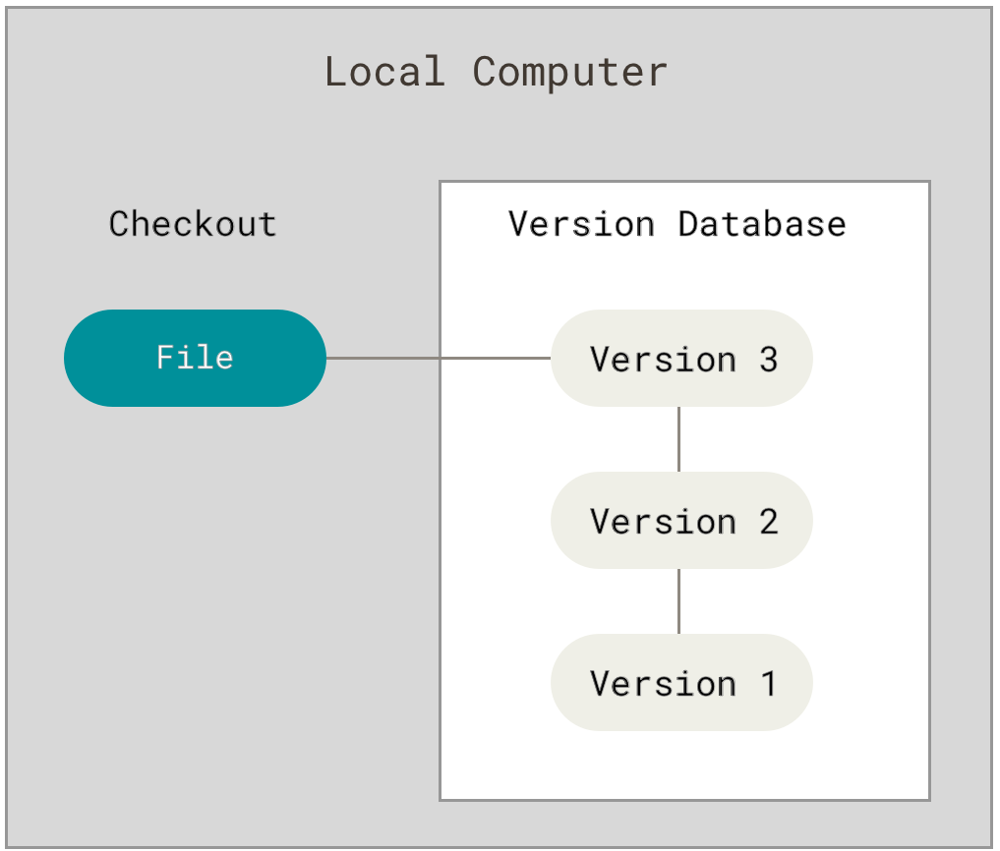]

<br>
- `r lk()` S. Chacon & B. Straub (2014), [Pro Git](https://git-scm.com/book/en/v2).


---
# Centralized Version Control Systems (CVCS)


.center[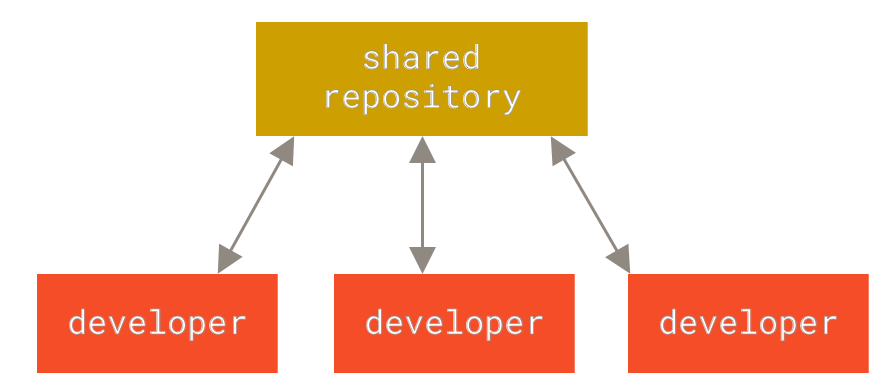]

- `r lk()` S. Chacon & B. Straub (2014), [Pro Git](https://git-scm.com/book/en/v2).

---
# Distributed Version Control Systems (DVCS)

.center[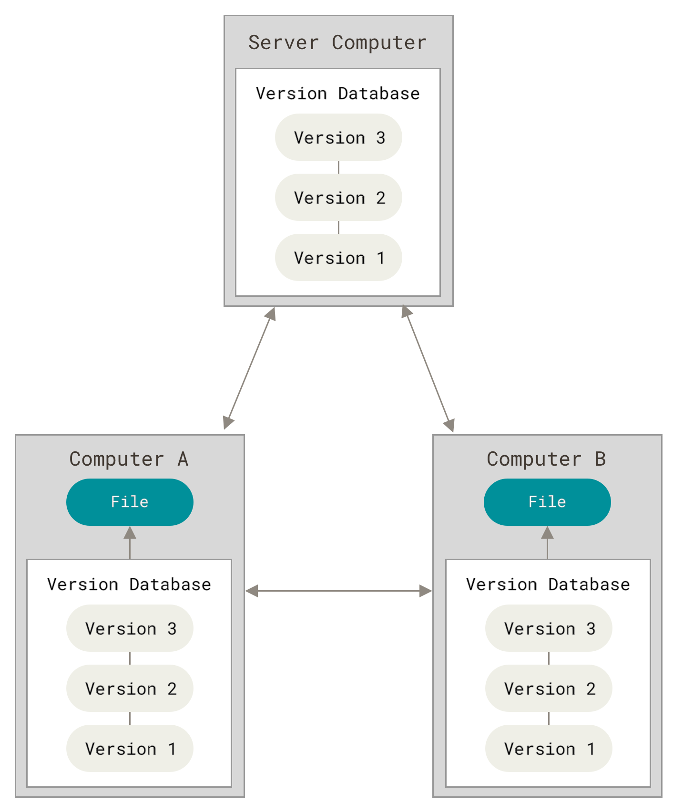]

- `r lk()` S. Chacon & B. Straub (2014), [Pro Git](https://git-scm.com/book/en/v2).


---
# `r gt()` is fully distributed 

## Every repository includes the entire database 

--

## database = `r emj("file_folder")` `.git` 

--

```sh
├── _00_introduction.Rmd
├── _01_learning_git.Rmd
├── _03_learning_rmarkdown.Rmd
├── _04_working_together.Rmd
├── DESCRIPTION
├── .git
├── .github
├── .gitignore
```

--

## `.git` is what we share!


---
# How does `r gt()` work?

## What does `r emj("file_folder")` `.git` include?

### `.git` stores **snapshots** 

.center[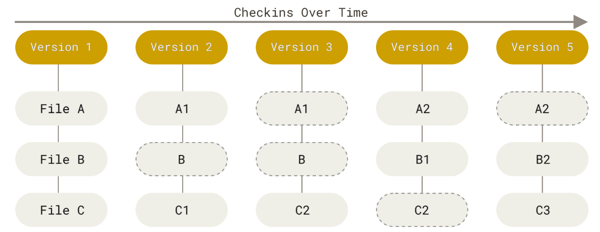]


---
#  **snapshots**?
.center[]

---
#  **snapshots**?

.center[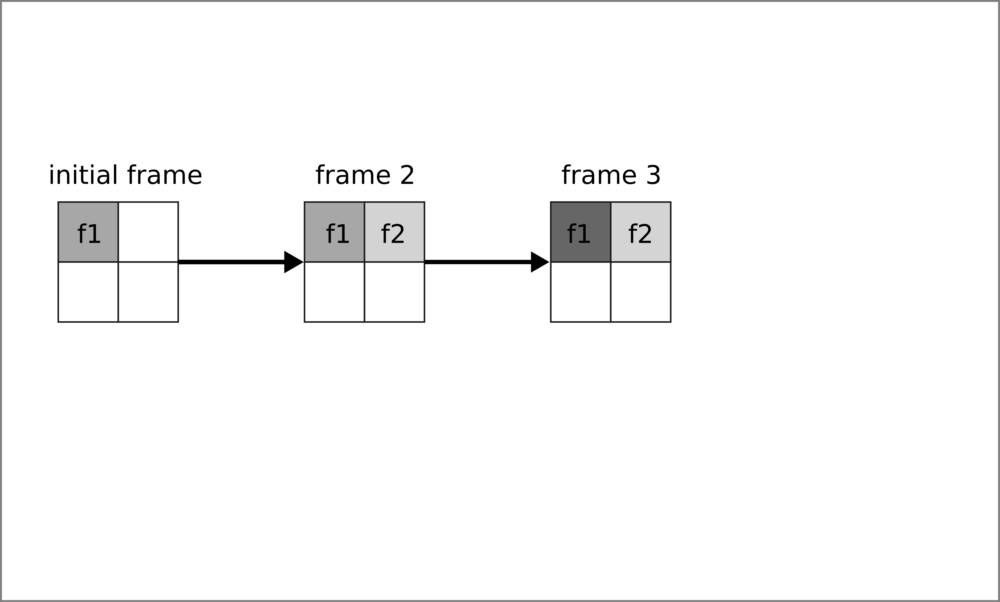]

---
#  **snapshots**?

.center[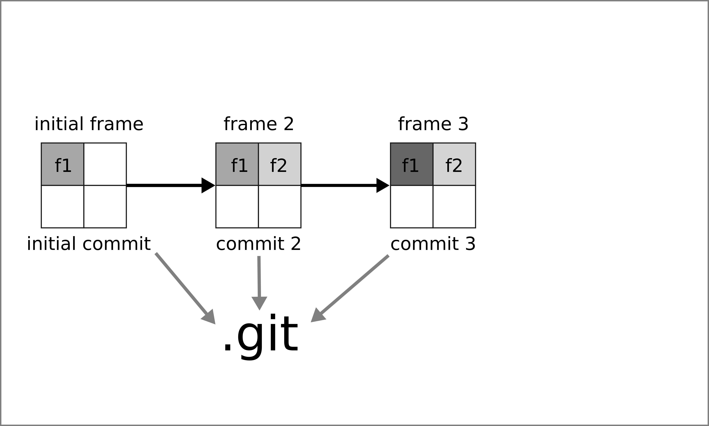]

---
#  **snapshots**?

.center[]

---
#  **snapshots**?

.center[]

---
#  **snapshots**?

.center[]

---
#  **snapshots**?

.center[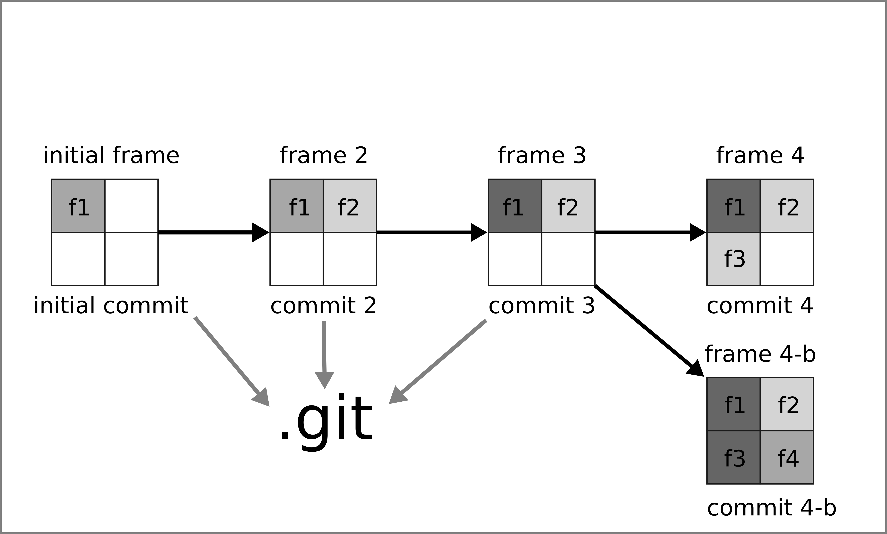]


---
# How do I create a commit?

--

### 1. Initiate the repository (`git init`; create `.git`)

--

### 2. Edit your files

--

### 3. Stage the modifications to be committed (`git add`; add selected files to the staging areas)

--

### 4. Create a new commit object (`git commit`; add the commit to `.git`)

--

### 5. Go back to step 2.


---
# `r lc()` Let's do this 
 
### 2 pieces of advice 

- Check this out `r ar()` https://ndpsoftware.com/git-cheatsheet.html#loc=index
- Use `git status` 


---
# How to create a good commit?

--

### Hard to say! 

--

### Some rules of thumb!

- 1 commit = one goal 
- 1 commit = a digestible amount of code (no minimal amount of code)


---
# How to write a good commit message?

--

### It may depend on the project! 

--

### Good habits 

- https://tbaggery.com/2008/04/19/a-note-about-git-commit-messages.html
- https://cbea.ms/git-commit/
  - Separate subject from body with a blank line
  - Limit the subject line to 50 characters
  - Capitalize the subject line
  - Do not end the subject line with a period
  - Use the imperative mood in the subject line
  - Wrap the body at 72 characters
  - Use the body to explain what and why vs. how

- https://gitmoji.dev/


---

class: inverse, center, middle

# Share your `.git` database


## Working with `r gh()`


---
# `r gt()` servers host remote repositories


.center[]

- `r lk()` S. Chacon & B. Straub (2014), [Pro Git](https://git-scm.com/book/en/v2).

 

---
# `r gt()` servers

## Sync `.git` via https or ssh


--

## Your own server

- e.g. a minimal ssh server (see [this post](https://kevcaz.insileco.io/notes/git/git_server_ssh/)),
- [GitLab](https://gitlab.com/) server.


--

## Dedicated hosting server

- **[GitHub](https://github.com/)**,
- [GitLab](https://gitlab.com/),
- [Bitbucket](https://bitbucket.org/).
- ...


---
# How `r gt()` works

.center[]

---
# How `r gt()` works &#8211; add a remote 

.center[]

--

- `git remote add remotename remoteURL`


---
# Interact with the remote repository

### Push

> git-push - Update remote refs along with associated objects


---
# Add a remote 

.center[]

- `git remote add remotename remoteURL`


---
# First push

.center[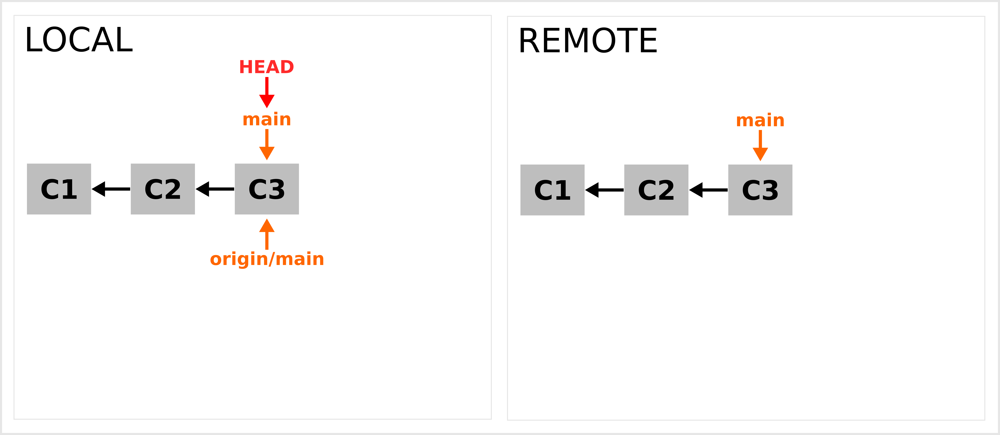]

--

### Locally a remote branch is added.

--

### `git clone` creates a local repository from a remote repository


---
# One more commit

.center[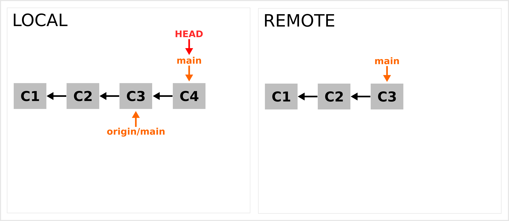]

---
# Another push `git push`

.center[]


---
# Interact with the remote repository

### Push

> git-push - Update remote refs along with associated objects

--

### Fetch & pull

> git-fetch - Download objects and refs from another repository

> git-pull - Fetch from and integrate with another repository or a local
       branch

???
git push allows to interact with the remote


---
# Remote repository is 1 commit ahead

.center[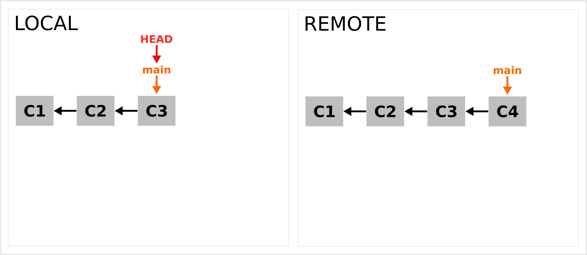]


---
# Fetch `git fetch`

.center[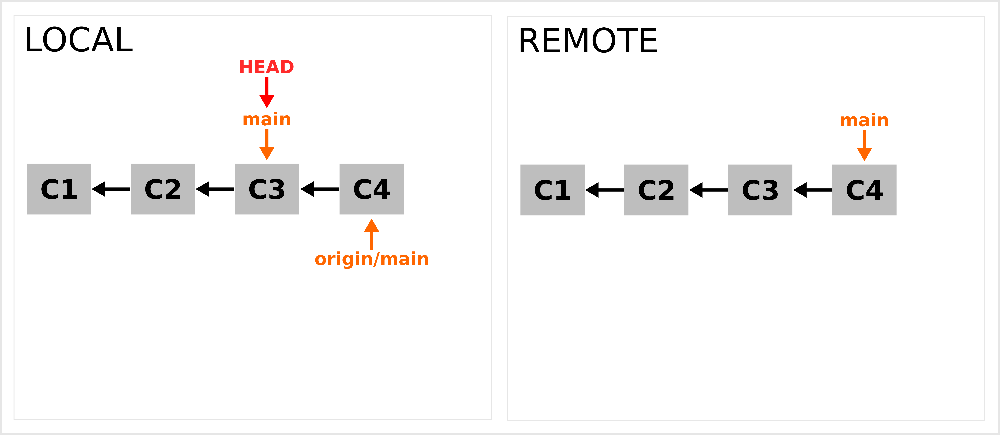]

---
# Merge `git merge`

.center[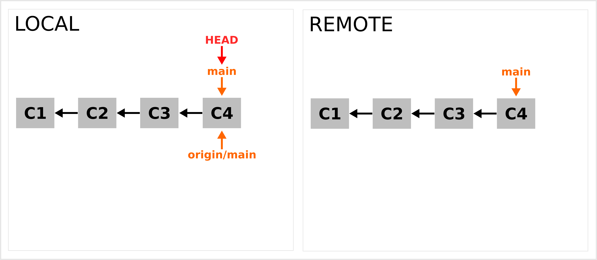]

--

## NB: fetch + merge = pull `git pull`


---
# GitHub `r gh()`

> GitHub, Inc. is a provider of Internet hosting for software development and version control using Git. It offers the distributed version control and source code management (SCM) functionality of Git, plus its own features. https://en.wikipedia.org/wiki/GitHub

--

- Git server + database-backed website
- `r rfa("plus")` [Web REST API](https://docs.github.com/en/rest)
- `r rfa("plus")` [Issue tracking system](https://en.wikipedia.org/wiki/Issue_tracking_system)
- `r rfa("plus")` [Project management features](https://github.com/features/issues)
- `r rfa("plus")` Host webpages ([GitHub Pages](https://pages.github.com/))
- `r rfa("plus")` Continuous Integration ([GitHub Actions](https://docs.github.com/en/actions))
- `r rfa("plus")` ...

--

### GitHub in numbers https://octoverse.github.com/


---
# 2 protocols to access a `r gh()` repo

## Https

- `r nf()` Since August 2021 a [personal access token](https://docs.github.com/en/authentication/keeping-your-account-and-data-secure/creating-a-personal-access-token) (PAT) is required
- https://cran.r-project.org/web/packages/credentials/vignettes/intro.html
- https://usethis.r-lib.org/articles/git-credentials.html
- https://git-scm.com/docs/git-credential-store

--

## SSH (preferred)

- https://phoenixnap.com/kb/generate-ssh-key-windows-10
- https://ndpsoftware.com/git-cheatsheet.html#loc=workspace;
- https://docs.github.com/en/authentication/connecting-to-github-with-ssh/adding-a-new-ssh-key-to-your-github-account


---
# `r lc()` Let's do this

## Add a remote, push and pull


---

class: inverse, center, middle

# Resources


---
# Key resources

.center[]

- `r lk()` S. Chacon & B. Straub (2014), Pro Git https://git-scm.com/book/en/v2
- `r gh()` https://github.com/progit/progit2
- `r bk()` https://github.com/progit/progit2/releases/tag/2.1.336


---
# Key resources

.center[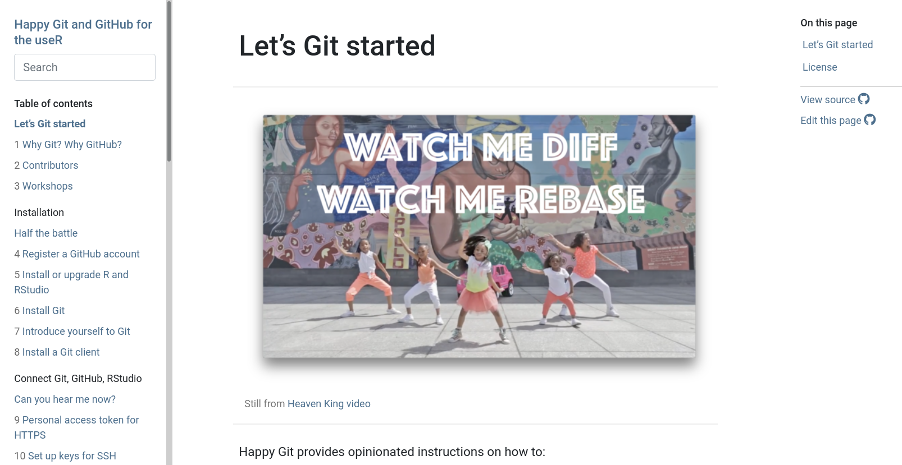]

- `r lk()` J. Bryan (2022), Happy git with R https://happygitwithr.com/

---
# Key resources

.center[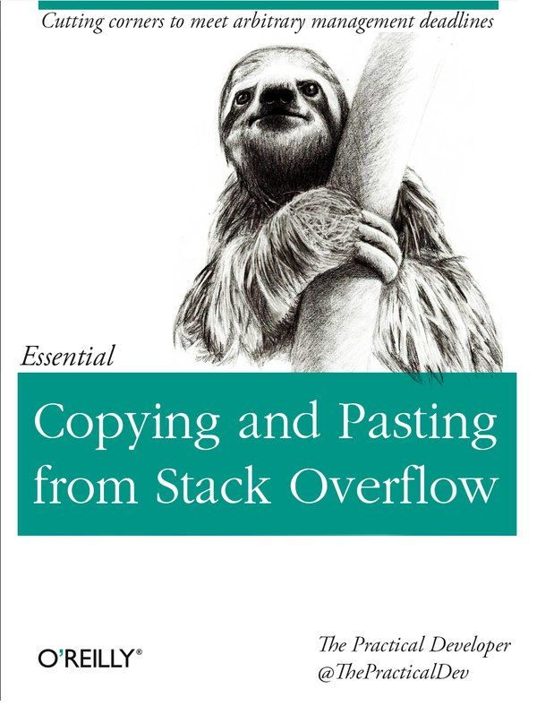]

- `r lk()` https://tra38.gitbooks.io/essential-copying-and-pasting-from-stack-overflow/content/
- `r so()` https://stackoverflow.com/


---
# Resources

### Books

- S. Chacon & B. Straub (2014), [Pro Git](https://git-scm.com/book/en/v2)
- J. Bryan (2022), [Happy git with R](https://happygitwithr.com/)

### Websites

- https://git.wiki.kernel.org/index.php/Main_Page
- https://mirrors.edge.kernel.org/pub/software/scm/git/docs/user-manual.html
- https://learngitbranching.js.org/
- Github: https://docs.github.com/en

### Cheat sheets

- https://ndpsoftware.com/git-cheatsheet.html#loc=workspace `r emj("fireworks")`
- https://education.github.com/git-cheat-sheet-education.pdf
- https://www.freecodecamp.org/news/git-cheat-sheet/
