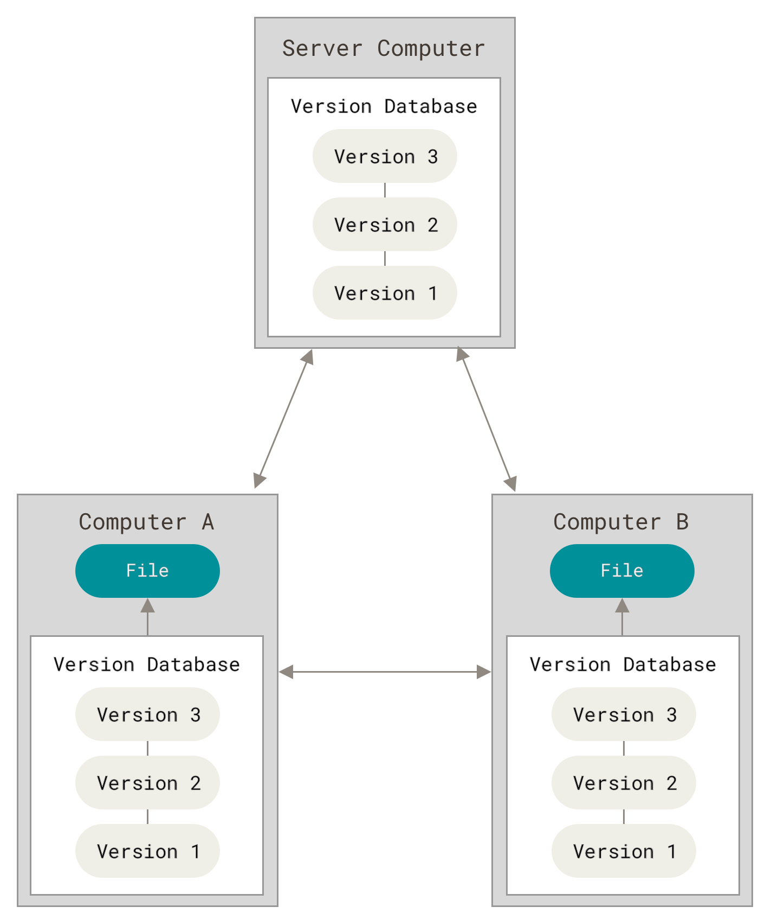
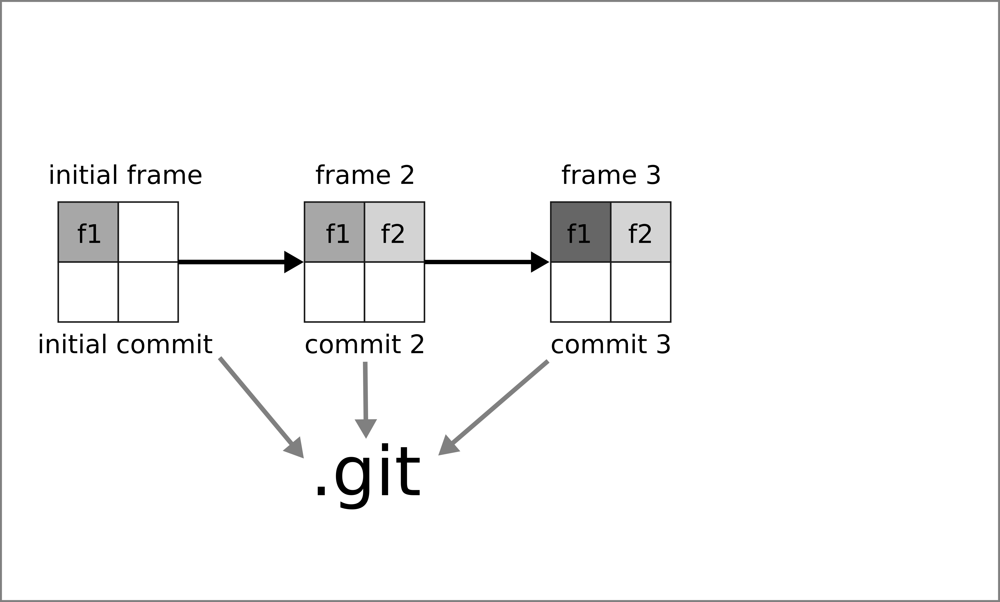
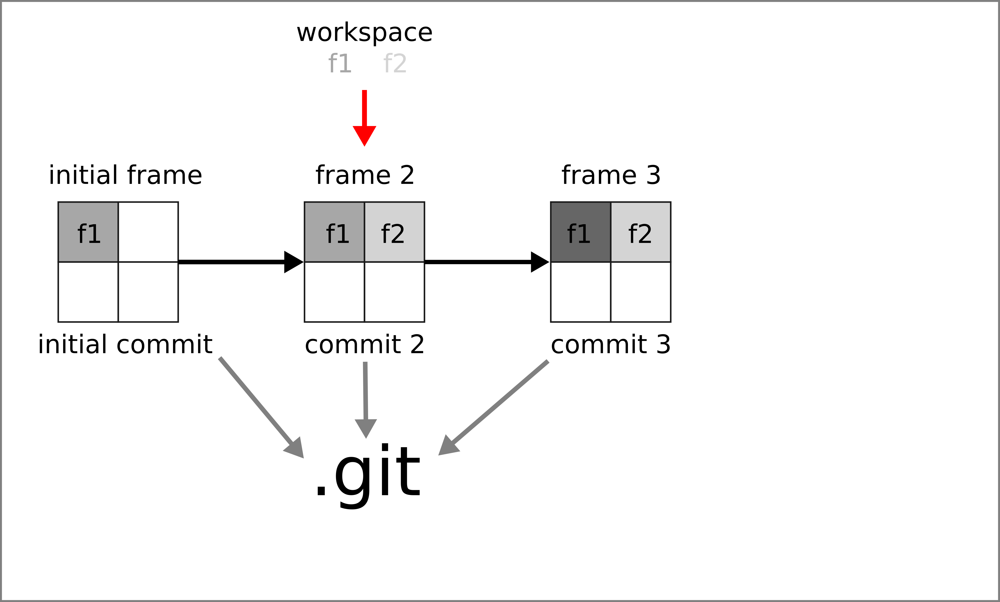
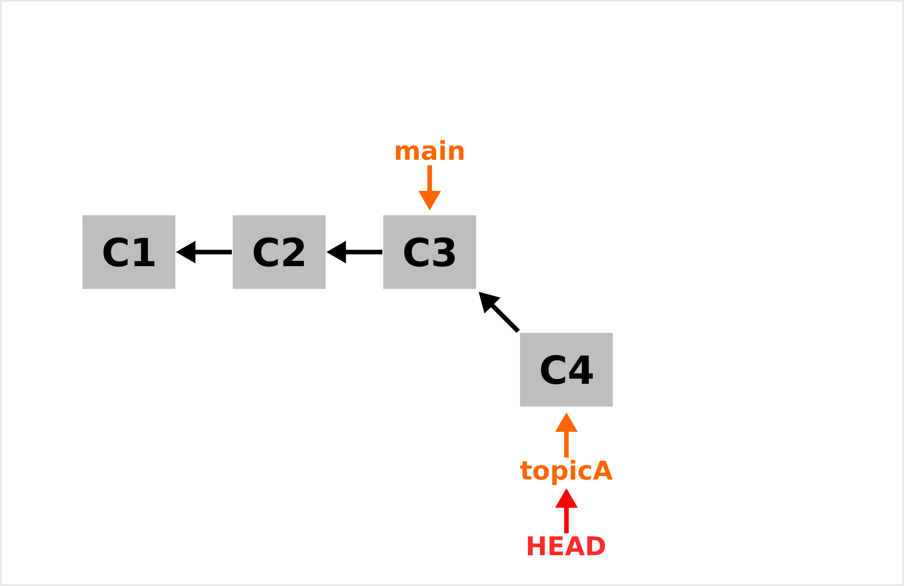
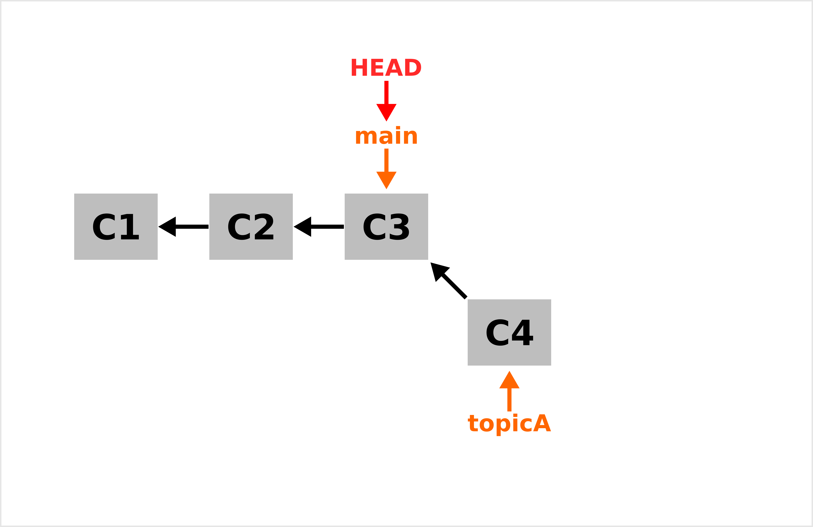
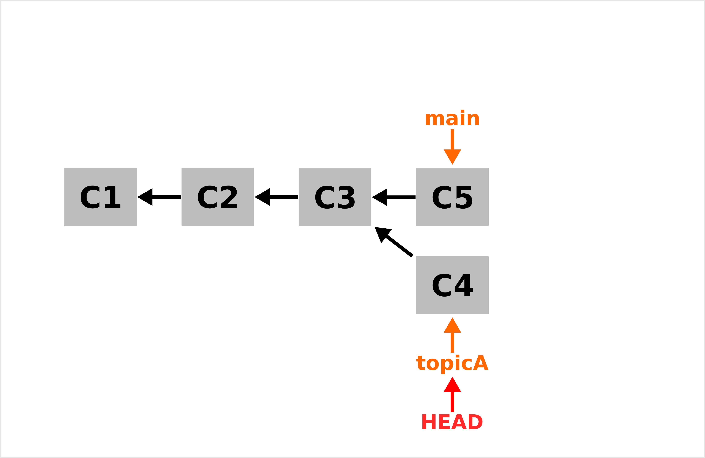
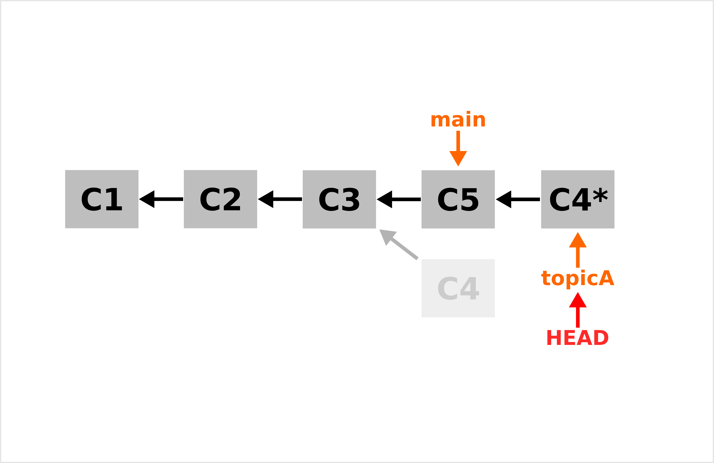

```{r setup_01, include = FALSE}
source("_setup.R")
# knitr::clean_cache(TRUE)
htmltools::tagList(
  xaringanExtra::use_clipboard(
    button_text = "<i class=\"fa fa-clipboard\"></i>",
    success_text = "<i class=\"fa fa-check\" style=\"color: #37abc8\"></i>",
  ),
  rmarkdown::html_dependency_font_awesome()
)
xaringanExtra::use_scribble()
```


class: inverse, center, middle

# Version Control System


## `r gt()` is a fully distributed version control system

---
# Version Control Systems (VCS)


.center[]

<br>
- `r lk()` S. Chacon & B. Straub (2014), [Pro Git](https://git-scm.com/book/en/v2).


---
# Centralized Version Control Systems (CVCS)


.center[]

- `r lk()` S. Chacon & B. Straub (2014), [Pro Git](https://git-scm.com/book/en/v2).

---
# Distributed Version Control Systems (DVCS)


.center[]

- `r lk()` S. Chacon & B. Straub (2014), [Pro Git](https://git-scm.com/book/en/v2).


---
# `r gt()` is fully distributed 

## Every repository includes the entire database 

--

## database = `r emj("file_folder")` `.git` 

--

```sh
$ tree -a -L 1 
.
├── _00_introduction.Rmd
├── _01_learning_git.Rmd
├── _03_learning_rmarkdown.Rmd
├── _04_working_together.Rmd
├── DESCRIPTION
├── .git
├── .github
├── .gitignore
```

--

## `.git` is what we share!


---
# How does `r gt()` work?

## What does `r emj("file_folder")` `.git` include?

### `.git` stores **snapshots** 

.center[]


---
#  **snapshots**?
.center[]

---
#  **snapshots**?

.center[]

---
#  **snapshots**?

.center[]

---
#  **snapshots**?

.center[]

---
#  **snapshots**?

.center[]

---
#  **snapshots**?

.center[]

---
#  **snapshots**?

.center[]


---
# How do I create a commit?à

--

### 1. Initiate the repository (`git init`; create `.git`)

--

### 2. Edit your files

--

### 3. Stage the modifications to be committed (`git add`; add selected files to the staging areas)

--

### 4. Create a new commit object (`git commit`; add the commit to `.git`)

--

### 5. Go back to step 2.


---
# `r lc()` Let's do this 
 
### 2 pieces of advice 

- Use `git status` 
- Keep this in mind `r ar()` https://ndpsoftware.com/git-cheatsheet.html#loc=index.


---
class: inverse, center, middle

# Branching


## `r gt()` killer feature


---
# Branching

## 1. Branch, branch and branch! 

--

## 2. Use `git branch` a lot!

<br>

--

### - Branching allows you to create divergent history which is exactly what you need for collaboration.

### - Branch is cheap.

---
# Branching

```sh
$ git branch topicA
$ git switch topicA
#> Switched to branch 'topicA'
```

---
# How `r gt()` works 

.center[]


---
# How `r gt()` works - branch

.center[]


---
# How `r gt()` works - switch 

.center[]


---
# How `r gt()` works - commit

.center[]


---
# Merging `git merge`

```sh
$ git switch main 
$ git merge topicA 
#> Updating 64ee016..aadf541
#> Fast-forward
#>  seq_ncol.R | 1 +
#>  1 file changed, 1 insertion(+)
#>  create mode 100644 seq_ncol.R
```


---
# How `r gt()` works - commit

.center[]


---
# How `r gt()` works - switch 

.center[]


---
# How `r gt()` works - merge (fast forward)

.center[]

???
now let's use references (refs) for pointers and objects for objets

---
# Not always as simple! 

.center[]

---
# How `r gt()` works - commit

.center[]

---
# How `r gt()` works - merge commit

.center[]


---
# `r lc()` Let's do this 
 
### 5 pieces of advice 

- List your branch with `git branch`
- Use `git status` 
- Use `git log`
- Keep this in mind `r ar()` https://ndpsoftware.com/git-cheatsheet.html#loc=index.
- Once a branch is merges, delete it `git branch -d topicA`


---
# Rebasing 

---
# How `r gt()` works 

.center[]

---
# How `r gt()` works - rebase

.center[]

---
# How `r gt()` works - rebase

.center[]

---
# How `r gt()` works - merge (fast forward)

.center[]


---
# `r lc()` Let's do this 

## Rebase a branch. 


---

class: inverse, center, middle

# Share your `.git` database


## Use `r gh()`


---
# `r gt()` servers


## Your own server

- e.g. a minimal ssh server (see [this post](https://kevcaz.insileco.io/notes/git/git_server_ssh/))

--

## Your own fully-featured server

- [GitLab](https://gitlab.com/)

--

## Dedicated hosting server

- [GitHub](https://github.com/)
- [GitLab](https://gitlab.com/)
- [Bitbucket](https://bitbucket.org/)
- ...

---
# GitHub `r gh()`

> GitHub, Inc. is a provider of Internet hosting for software development and version control using Git. It offers the distributed version control and source code management (SCM) functionality of Git, plus its own features. https://en.wikipedia.org/wiki/GitHub

--

- Git server + database-backed website
- `r rfa("plus")` [Web REST API](https://docs.github.com/en/rest)
- `r rfa("plus")` [Issue tracking system](https://en.wikipedia.org/wiki/Issue_tracking_system)
- `r rfa("plus")` [Project management features](https://github.com/features/issues)
- `r rfa("plus")` Host webpages ([GitHub Pages](https://pages.github.com/))
- `r rfa("plus")` Continuous Integration ([GitHub Actions](https://docs.github.com/en/actions))
- `r rfa("plus")` ...

--

### GitHub in numbers https://octoverse.github.com/


---
# `r lc()` Let's do this 
 
### 3 pieces of advice 

- Branch a lot,
- Use the main/master branch as the sync branch,
- Keep this in mind `r ar()` https://ndpsoftware.com/git-cheatsheet.html#loc=index.


---

class: inverse, center, middle

# Resources


---
# Key resources

.center[]

- `r lk()` S. Chacon & B. Straub (2014), Pro Git https://git-scm.com/book/en/v2
- `r gh()` https://github.com/progit/progit2
- `r bk()` https://github.com/progit/progit2/releases/tag/2.1.336


---
# Key resources

.center[]

- `r lk()` J. Bryan (2022), Happy git with R https://happygitwithr.com/

---
# Key resources

.center[]

- `r lk()` https://tra38.gitbooks.io/essential-copying-and-pasting-from-stack-overflow/content/
- `r so()` https://stackoverflow.com/


### Books

- S. Chacon & B. Straub (2014), [Pro Git](https://git-scm.com/book/en/v2)
- J. Bryan (2022), [Happy git with R](https://happygitwithr.com/)

### Websites

- https://git.wiki.kernel.org/index.php/Main_Page
- https://mirrors.edge.kernel.org/pub/software/scm/git/docs/user-manual.html
- https://learngitbranching.js.org/
- Github: https://docs.github.com/en
- GitLab: https://docs.gitlab.com/ee/topics/git/#git

### Cheat sheets

- https://ndpsoftware.com/git-cheatsheet.html#loc=workspace `r emj("fireworks")`
- https://education.github.com/git-cheat-sheet-education.pdf
- https://www.freecodecamp.org/news/git-cheat-sheet/
