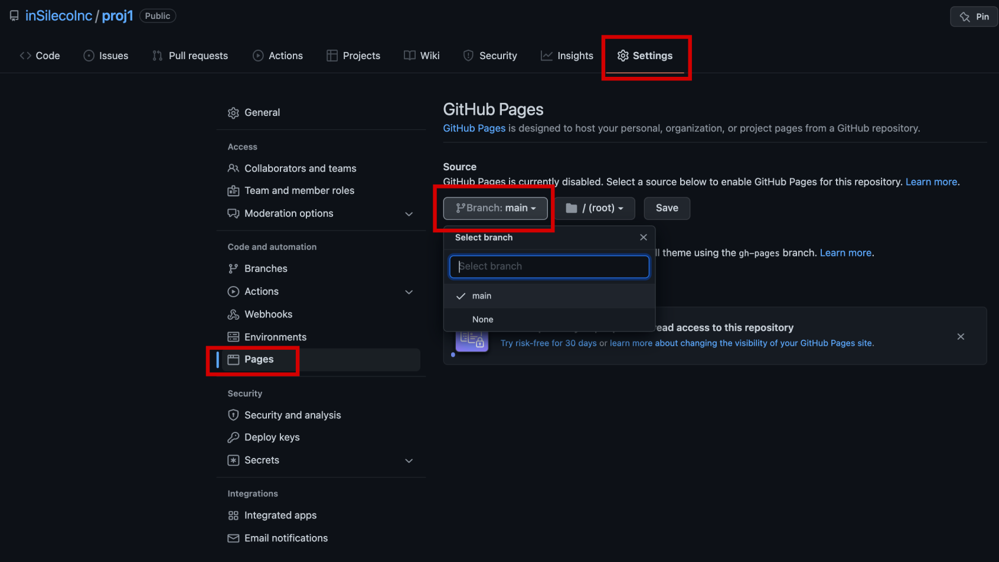
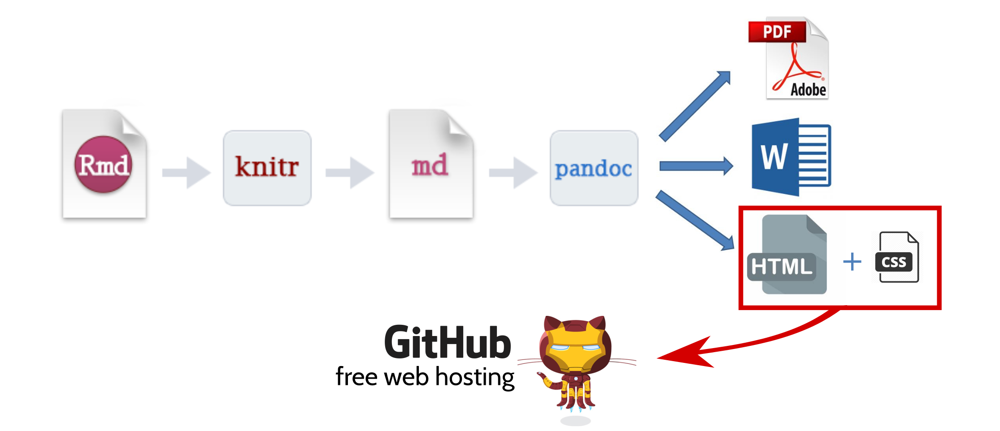

<!-- rmarkdown::render("_05_github_pages.Rmd") -->

```{r setup_05, include = FALSE}
source("_setup.R")
# knitr::clean_cache(TRUE)
htmltools::tagList(
  xaringanExtra::use_clipboard(
    button_text = "<i class=\"fa fa-clipboard\"></i>",
    success_text = "<i class=\"fa fa-check\" style=\"color: #37abc8\"></i>",
  ),
  rmarkdown::html_dependency_font_awesome()
)
xaringanExtra::use_scribble()
```

class: inverse, center, middle

# GitHub Pages

<html><div style='float:left'></div><hr color='#ffdd55' style="margin-top: -60px;" size=1px width=720px></html>

## Transform your `r gh()` repo into a website

---
# GitHub Pages

GitHub provides a free web hosting services called [GitHub Pages](https://docs.github.com/en/pages) that allows you to turn your `r gh()` repo into websites

> GitHub Pages is a static site hosting service that takes HTML, CSS, and JavaScript files straight from a repository on GitHub, optionally runs the files through a build process, and publishes a website. 

---
# GitHub Pages

There are [multiple advantages](https://medium.com/@cheukting.ho/newbie-tips-5-advantage-of-using-github-pages-for-hosting-35bee4c1ce14) to use GitHub Pages for developpers

- Free 
- Version control
- Custom domain 
- Supports HTTPS

--

In our case, it also makes it easy to share and disseminate our research and our work through: 

- [Blogs](https://blog.insileco.io/)
- [Websites](https://www.insileco.io/)
- [Books & reports](https://kevcaz.insileco.io/Rmarkdowndocfr/)
- [Presentations](https://www.insileco.io/learning_git/)

---
# GitHub Pages 

## How to create github page from repository

1. Open a new GitHub repository and activate GitHub pages
2. Link this new repo to a RStudio project
3. Add a `.Rmd` document and generate the HTML document (we know that part!)
4. Declare (`add`) and document (`commit`) the modifications on the repository
5. Send these modifications with the HTML output on GitHub via RStudio


---
# GitHub Pages 

## How to create github page from repository

1. Open a new GitHub repository and ***activate GitHub pages***
2. Link this new repo to a RStudio project
3. Add a `.Rmd` document and generate the HTML document (we know that part!)
4. Declare (`add`) and document (`commit`) the modifications on the repository
5. Send these modifications with the HTML output on GitHub via RStudio

--

`r tr()` exported html must be named `index.html`


---
# GitHub Pages 

## Activating GitHub Pages

- Navigate to your `r gh()` settings 
- Go to `Pages` 
- Select `main` branch as source

<center></img></center>


---

# GitHub Pages

## Activating GitHub Pages

### Congratulations!

<center></img></center>

--
... now be patient & wait few minutes to see the results

```{r echo=FALSE, out.width="35%", fig.align = 'center'}
knitr::include_graphics("img/part4/ironcat.jpeg")
```

---
# `r lc()` Let's do this

## Transform our repo into a website

```{r echo=FALSE, out.width="100%"}

```


---
# Additional ressources 

*This was a brief intro to GitHub Pages and the possibilities it offers*

***For more:***

- [GitHub Pages documentation page](https://docs.github.com/en/pages)
- [Jekyll](https://jekyllrb.com/)
  - [Jekyll & GitHub Pages](https://docs.github.com/en/pages/setting-up-a-github-pages-site-with-jekyll)
  - Example: [`r gh()`](https://github.com/jekyll/example) [`r rfa("globe-americas")`](http://jekyll.github.io/example/)
- [Hugo](https://gohugo.io/)
  - [GitHub Pages & Hugo](https://gohugo.io/hosting-and-deployment/hosting-on-github/)
  - Example: [`r gh()`](https://github.com/inSilecoInc/inSilecoInc.github.io) [`r rfa("globe-americas")`](https://www/insileco.io/)


